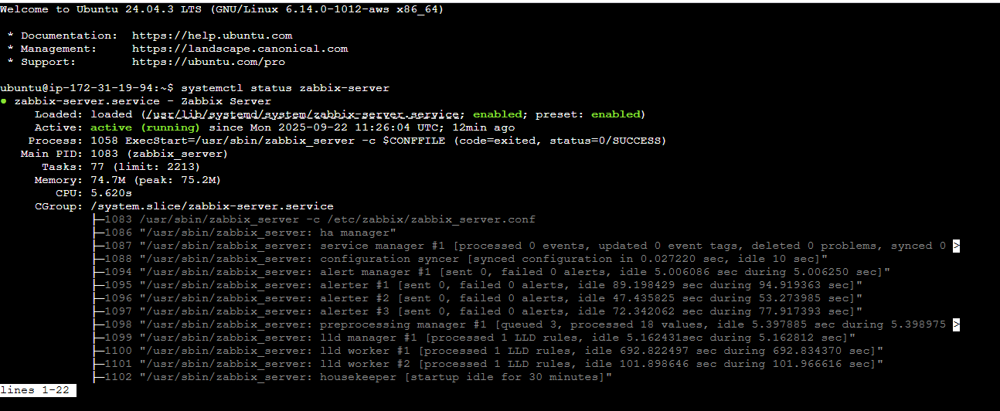
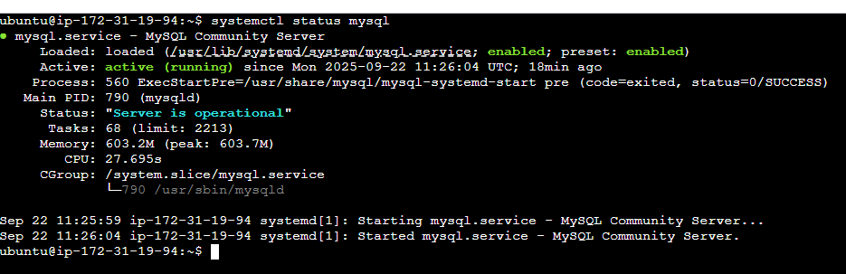
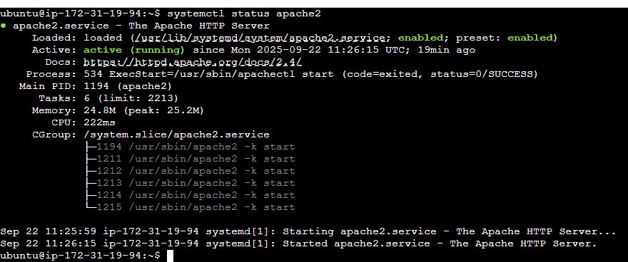
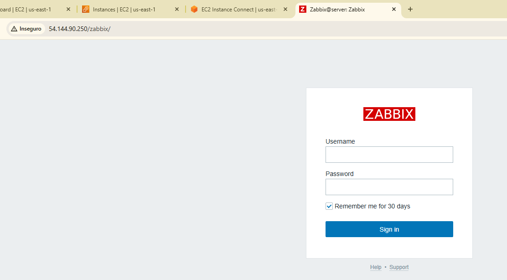
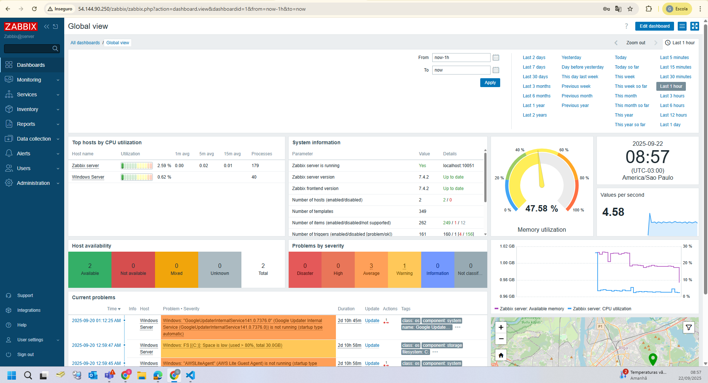

# Laboratório Zabbix: Instalação com MySQL no Linux  

Este laboratório demonstra a instalação e configuração inicial do **Zabbix Server** utilizando o **MySQL** como banco de dados em um ambiente Linux.  

---

##  Arquitetura  

  

*O diagrama mostra a arquitetura básica: servidor Linux rodando Zabbix Server, Zabbix Agent, MySQL e frontend web (Apache/Nginx).*  

---

## 🔧 Etapas Realizadas  

- **Sistema Operacional**:  
  - Ubuntu 24.04 LTS atualizado.  

- **Instalação do Banco de Dados (MySQL)**:  
  - Pacote `mysql-server` instalado.  
  - Criado banco de dados `zabbix`.  
  - Usuário `zabbix` criado com permissões no banco.  

- **Instalação do Zabbix**:  
  - Repositório oficial configurado.  
  - Pacotes `zabbix-server-mysql`, `zabbix-frontend-php`, `zabbix-apache-conf` e `zabbix-agent` instalados.  
  - Banco inicial importado via `zcat /usr/share/doc/zabbix-sql-scripts/mysql/create.sql.gz | mysql -uzabbix -p zabbix`.  

- **Configuração dos Serviços**:  
  - Arquivo `/etc/zabbix/zabbix_server.conf` ajustado para conexão com MySQL.  
  - Serviços habilitados e inicializados:  
    ```bash
    systemctl enable zabbix-server zabbix-agent apache2 mysql
    systemctl start zabbix-server zabbix-agent apache2 mysql
    ```  

- **Acesso ao Frontend Web**:  
  - Zabbix acessível em `http://<servidor>/zabbix`.  
  - Configuração inicial realizada (idioma, timezone, conexão ao banco).  

---

## 📷 Evidências  

| Componente                  | Screenshot                         |
|-----------------------------|-------------------------------------|
| 1. Zabbix    |  |
| 2. Banco MySQL criado       |      |
| 3. Apache2       |      |
| 4. Tela de login Zabbix     |      |
| 5. Dashboard inicial Zabbix |  |

---

## ✅ Resultado  

O ambiente Zabbix + MySQL foi instalado com sucesso, permitindo:  
- Coleta de métricas via **Zabbix Agent**.  
- Armazenamento persistente no banco de dados **MySQL**.  
- Acesso via frontend web para administração e configuração.  
